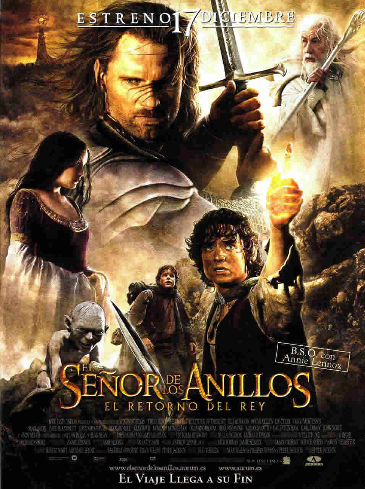

\newpage


```{r setup, include=FALSE}
knitr::opts_chunk$set(echo = TRUE)
```

##1. Título del dataset
Las mejores películas de la historia

##2. Subtítulo del dataset
Las mejores películas de la historia según los usuarios de www.ecartelera.com
Este dataset es un listado de las mejores películas de la historia según sus 69 usuarios registrados.  

##3. Imagen
"El señor de los anillos. El retorno del Rey". La mejor película de la historia según los usuarios registrados de www.ecartelera.com.  
<center> 
{width=64%}
<center> 

##4. Contexto
El conjunto de datos recopila las mejores películas de la historia según la puntuación que le dan los usuarios registrados de www.ecartelera.com. 

##5. Contenido

```{r, echo=FALSE, warning=FALSE}
library(readr)
datos <- read_csv("10_Dataset.csv", col_types = cols(ID = col_number(), 
    Año = col_number(), Puesto = col_number(), 
    Puntaje = col_number()))
```

El número de registros (películas) en el dataset es `r dim(datos)[1]` y el número de variables es `r dim(datos)[2]`. Los nombres de las variables son: `r names(datos)`.  
Donde:  
- ID: Es el código único que permite identificar de la película  
- Título: Es el título de la película  
- Puesto: Es el puesto que ocupa la película dentro del ranking  
- Año: Es el año de estreno de la película  
- Puntaje: Es el puntaje que ha recibido la película por los usuarios registrados  

El periodo de tiempo de los datos es, de acuerdo a la información recogida en el misma página web desde el año 2005 a la actualidad.  

La recolección de los datos la realizan en www.ecartelera.com solo con los usuarios registrados, quienes son los que puntuan las películas, sobre un listado de películas disponibles a puntuar.

```{r, echo=FALSE, warning=FALSE}
datos.na = data.frame(sapply(datos, complete.cases)) #Utilizamos la función "complete.cases" para identificar los valores perdidos "NA" con FALSE
a = data.frame(sapply(-datos.na+1, sum)) #Mediante un artilugio, convertimos los TRUE que equivalen a 1 en -1 y les sumamos 1, para dar por resultados final 0; y a los FALSE que equivalen a 0 les sumamos 1, para dar por resultados final 1.
#La suma de cada variable nos indicará cuántos valores perdidos tiene cada variable, si es que los tuviese.
a = data.frame(t(a))
```

*Nota:* Cabe indicar que en el dataset existen `r a$Puntaje` películas que no tienen puntuación, pues ningún usuario registrado las ha puntuado, bien porque no han sido de su agrado o bien porque aún no se han estrenado.

##6. Agradecimientos
El propietario de la información del dataset es www.ecartelera.com. Asimismo, también son propietarios de la imagen incluida en este documento.   
Los datos fueron capturados mediante técnicas de Web Scraping, cuyo código fue elaborado en Python 2.7, y se utilizaron las librerías BeautifulSoup, requests y pandas.  

##7. Inspiración
El dataset me pareció interesante, pues a partir de los datos se puede, por ejemplo, elaborar un gráfico donde se observe la suma de los puntajes para los años de estreno de las películas. Con ese gráfico podríamos hacernos una idea de qué año es el más popular en cuanto a gustos de películas entre los usuarios registrados de www.ecartelera.com.  

Un proyecto interesante podría ser el escrapear el resumen de cada película, e identificar cuáles son las palabras (que no sean conectores) que más se repiten. A menera de una nube de palabras, por cada década.    

Aplicando lo escrito líneas atrás, se observa en el siguiente gráfico que el acumulado de los puntajes de las películas se concentran a partir del año 2000, y sobre todo en los últimos 5 años anteriores al 2018.

```{r, echo=FALSE, message=FALSE}
library(dplyr)

datos.completos = datos %>%
  filter(complete.cases(datos))

datos.resumen <- datos.completos %>%
  group_by(Año) %>%
  summarise(Puntaje=sum(Puntaje,na.rm = T))
```

```{r, echo=FALSE}
library(ggplot2)

ggplot(data=datos.resumen, aes(x=Año, y=Puntaje))+
  theme(panel.grid.major = element_line(colour="grey"))+
  geom_bar(show.legend=F, stat="identity", color="dodgerblue4", fill="gray80") +
  ggtitle("Puntaje acumulado de las películas, por año")+
  theme(plot.title=element_text(size=rel(1.5), vjust=2, face="bold"))+
  labs(x="Años", y="Puntaje acumulado")+
  theme(axis.title.x=element_text(face="italic", vjust=-0.5, size=rel(1.2)))+
  theme(axis.title.y=element_text(face="italic", vjust=1.5, size=rel(1.2)))+
  theme(legend.title=element_text(colour="blue", size=12, face="bold"))+
  scale_x_continuous(breaks=c(seq(min(datos.resumen$Año), max(datos.resumen$Año),5),2018)) +
  #scale_x_continuous(breaks=seq(min(datos.resumen$Año), max(datos.resumen$Año), 6)) +
  #scale_x_continuous(breaks=c(min(datos.resumen$Año),seq(min(datos.resumen$Año+5),
   #                                                      max(datos.resumen$Año-3), 5),
    #                          max(datos.resumen$Año))) +
  theme(axis.text.x = element_text(angle = 90, hjust = 1)) 
```


##8. Licencia
La licencias escogida es **CC BY-NC-SA 4.0**. Los motivos son los siguientes:  
- Atribución: Usted debe dar crédito de manera adecuada al autor e indicar si se han realizado cambios. Puede hacerse en cualquier forma razonable, pero no de forma tal que sugiera que usted o su uso tienen el apoyo de la licenciante. ***Con esto recibiremos el reconocimiento respectivo.***    
- NoComercial: Usted no puede hacer uso del material con propósitos comerciales. ***Dado que no tenemos autorización expresa de www.ecartelera.com para escrapear sus datos, el uso comercial de los mismos por parte de terceros no debería estar permitido.***  
- CompartirIgual: Si remezcla, transforma o crea a partir del material, debe distribuir su contribución bajo la lamisma licencia del original. ***Con esto aseguramos que el espíritu de nuestra licencia perdure en la licencia de algún tercero que se haya beneficiado con nuestro código.***  
- No hay restricciones adicionales: No puede aplicar términos legales ni medidas tecnológicas que restrinjan legalmente a otras a hacer cualquier uso permitido por la licencia. ***Finalmente, con esto favorecemos que otros investigadores puedan usar nuestro código.***    

Fuente: https://creativecommons.org/licenses/by-nc-sa/4.0/deed.es

##9. Código  
El código elaborado con Python 2.7 está disponible también en: https://github.com/jorgemusaja/Practica01_WebScraping/blob/master/09_Codigo.py

##10. Dataset    
El dataset en formato csv está dispoible en: https://github.com/jorgemusaja/Practica01_WebScraping/blob/master/10_Dataset.csv

